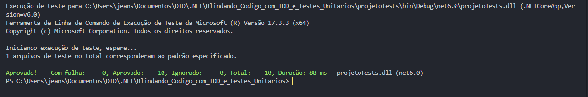

# Blindando o Código com TDD e Testes Unitários

Projeto onde foi criado um sistema de Calculadora, com o foco no método de TDD (Test Driven Development) e testes unitários. Feito durante o Bootcamp WEX .NET da DIO.

### Funções do sistema
* Realizar as principais operações (+, -, *, /)
* Salvar as 3 ultimas operações no historico (List)

## Resultado dos testes 

## Tópicos abordados durante esse projeto:
* Método TDD (Test Driven Development)
* Testes Unitários

## Tecnologias utilizadas no projeto
* .NET
* C#

 

<h3>Contribuindo</h3>

⭐️ Star o projeto

🐛 Encontrar e relatar issues